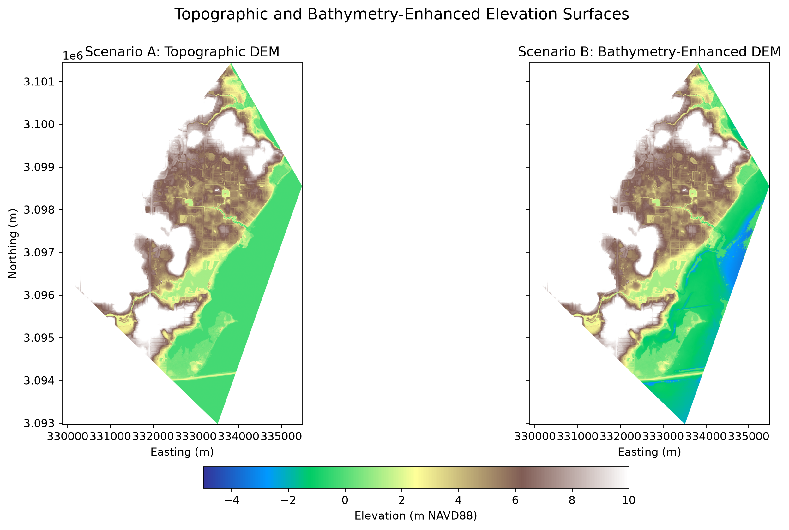
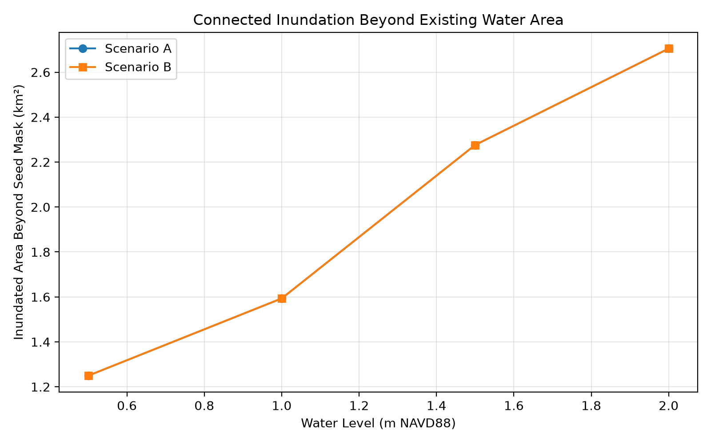
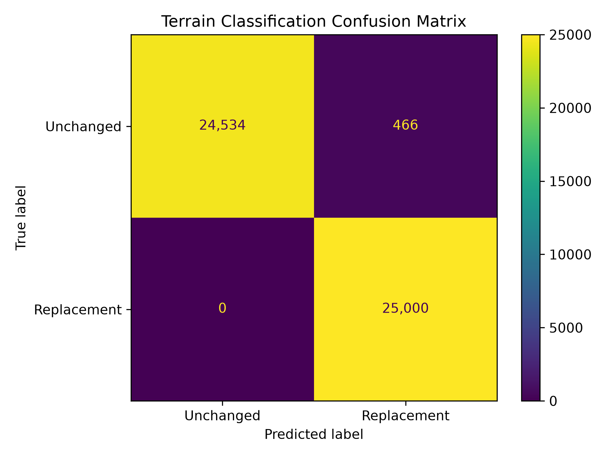
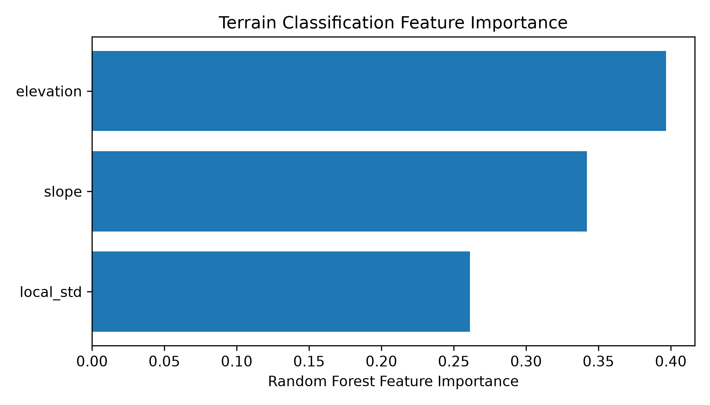

# Summary

This project explores how the representation of submerged terrain affects static coastal inundation mapping. The analysis compares a USGS 3DEP 1-m topographic DEM with a bathymetry-enhanced elevation surface created using the 2019 NOAA Tampa Bay Topobathy DEM. The study area is located along Tampa Bay, Florida, where both datasets overlap.

Two elevation scenarios are created. Scenario A uses the original USGS topographic DEM, which contains a nearly flat elevation surface over much of the coastal water area. Scenario B keeps the same USGS land elevations but replaces the identified flat-water cells with NOAA bathymetry. Both scenarios are then tested using a simple connectivity-based inundation model at water levels from 0.5 to 2.0 m NAVD88.

The bathymetry changes the submerged elevation surface considerably, but does not change the inundation extent beyond the existing water area in this static experiment. This helps show the limitation of using a static water surface when studying how bathymetry may affect coastal flooding.

The project also includes a multidimensional NetCDF output and a small machine learning experiment using terrain characteristics.

# Usage

### 1. Clone this repository

```bash
git clone <repository-url>
cd coastal-flood-analysis
```

### 2. Download the elevation data

The analysis uses:

- USGS 3DEP 1-m DEM (`FL_Peninsular_2018_D18`)
- NOAA 2019 Tampa Bay Topobathy DEM
- NOAA Continually Updated Shoreline Product (CUSP)

Raw datasets are not included in this repository because of their file size. Place the downloaded files in the corresponding folders under `data/raw/`.

The CUSP shoreline data are used for shoreline inspection only and are not used to define the bathymetry-replacement mask.

### 3. Create a Python environment

Create and activate a Python virtual environment, then install the required packages:

```bash
python -m venv .venv
source .venv/bin/activate
pip install -r requirements.txt
```

The main packages used are NumPy, Pandas, Rasterio, GeoPandas, Shapely, PyProj, SciPy, Matplotlib, xarray, netCDF4, and scikit-learn.

### 4. Run the analysis

The processing scripts are located in the `src` folder and are numbered according to the processing order.

For example:

```bash
python src/01_inspect_dem_data.py
python src/02_mosaic_usgs_dem.py
python src/03_clip_dems_to_aoi.py
```

Continue the scripts in numerical order through:

```bash
python src/13_terrain_classification.py
```

Intermediate rasters are saved in `data/processed`, figures are saved in `figures`, and analysis results are saved in `outputs`.

# Results

The USGS and NOAA elevation datasets were aligned to a common 1-m grid. Both datasets are referenced to NAVD88, and the NOAA elevations were converted from US survey feet to meters before alignment.

Approximately 4.96 million cells identified within the flat-water area of the USGS DEM were replaced with NOAA bathymetry to create Scenario B. The median elevation change within the replaced cells was about -1.03 m.



Static inundation was tested at 0.5, 1.0, 1.5, and 2.0 m NAVD88 using 8-neighbor connectivity from the coastal-water seed area. The inundation area and depth beyond the existing water seed were the same between Scenario A and Scenario B at all tested water levels.



This does not mean bathymetry has no effect on coastal flooding. The model used here imposes a static water-surface elevation, so the bathymetry cannot affect surge propagation, currents, friction, storage, or timing. A hydrodynamic model would be needed to investigate these processes.

### NetCDF

The elevation scenarios, coastal seed mask, and inundation masks were combined into a multidimensional NetCDF dataset using xarray. The inundation results are stored along a water-level dimension containing 0.5, 1.0, 1.5, and 2.0 m NAVD88.

### Terrain classification

A small Random Forest experiment was used to classify the identified bathymetry-replacement cells using elevation, slope, and local elevation variability. A balanced sample of 200,000 cells was divided into training and testing data, and the model achieved 99.1% test accuracy.





The experiment is exploratory. Because elevation was also used when defining the replacement mask, the classification result is not an independent validation of bathymetry prediction.

# Notes

- Scenario B is a hybrid elevation surface. USGS elevations are retained outside the identified replacement area while NOAA elevations are used within the identified coastal-water area.
- The flat-water cells were identified from the strong elevation signature in the USGS DEM and comparison with the NOAA topobathy data.
- The identified USGS water elevation should not be interpreted as a shoreline datum.
- Water levels used in the analysis are synthetic sensitivity levels, not observations from a historical storm.
- The inundation model is based on elevation and 8-neighbor raster connectivity. It does not simulate waves, currents, rainfall, river discharge, tides, or other hydrodynamic processes.
- The machine learning experiment is exploratory and is not an independent bathymetry prediction model.
- Raw and processed DEMs, generated inundation GeoTIFFs, and the generated NetCDF file are excluded from Git because of their file size.

# Data Sources

- U.S. Geological Survey (USGS) 3D Elevation Program (3DEP), 1-m DEM
- NOAA 2019 NGS Topobathy Lidar DEM: Tampa Bay, Florida
- NOAA Continually Updated Shoreline Product (CUSP)

# Contact

Musa Animashaun
Email: musaanimashaun@gmail.com